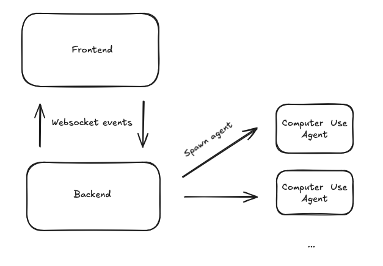

# CUA2 - Computer Use Agent 2

An AI-powered automation interface featuring real-time agent task processing, VNC streaming, and step-by-step execution visualization.

## 🚀 Overview

CUA2 is a full-stack application that provides a modern web interface for AI agents to perform automated computer tasks. The system features real-time WebSocket communication between a FastAPI backend and React frontend, allowing users to monitor agent execution, view screenshots, track token usage, and stream VNC sessions.

## 🏗️ Architecture



## 🛠️ Tech Stack

### Backend (`cua2-core`)
- **FastAPI**
- **Uvicorn**
- **smolagents** - AI agent framework with OpenAI/LiteLLM support

### Frontend (`cua2-front`)
- **React TS**
- **Vite**

## 📋 Prerequisites

- **Python** 3.10 or higher
- **Node.js** 18 or higher
- **npm**
- **uv** - Python package manager

### Installing uv

**macOS/Linux:**
```bash
curl -LsSf https://astral.sh/uv/install.sh | sh
```

For more installation options, visit: https://docs.astral.sh/uv/getting-started/installation/


## 🚀 Getting Started

### 1. Clone the Repository

```bash
git clone https://github.com/huggingface/CUA2.git
cd CUA2
```

### 2. Install Dependencies

Use the Makefile for quick setup:

```bash
make sync
```

This will:
- Install Python dependencies using `uv`
- Install Node.js dependencies for the frontend

Or install manually:

```bash
# Backend dependencies
cd cua2-core
uv sync --all-extras

# Frontend dependencies
cd ../cua2-front
npm install
```

### 3. Environment Configuration

Copy the example environment file and configure your settings:

```bash
cd cua2-core
cp env.example .env
```

Edit `.env` with your configuration:
- API keys for OpenAI/LiteLLM
- Database connections (if applicable)
- Other service credentials

### 4. Start Development Servers

#### Option 1: Using Makefile (Recommended)

Open two terminal windows:

**Terminal 1 - Backend:**
```bash
make dev-backend
```

**Terminal 2 - Frontend:**
```bash
make dev-frontend
```

#### Option 2: Manual Start

**Terminal 1 - Backend:**
```bash
cd cua2-core
uv run uvicorn cua2_core.main:app --reload --host 0.0.0.0 --port 8000
```

**Terminal 2 - Frontend:**
```bash
cd cua2-front
npm run dev
```

### 5. Access the Application

- **Frontend**: http://localhost:8080
- **Backend API**: http://localhost:8000
- **API Documentation**: http://localhost:8000/docs
- **ReDoc**: http://localhost:8000/redoc

## 📁 Project Structure

```
CUA2/
├── cua2-core/                      # Backend application
│   ├── src/
│   │   └── cua2_core/
│   │       ├── app.py              # FastAPI application setup
│   │       ├── main.py             # Application entry point
│   │       ├── models/
│   │       │   └── models.py       # Pydantic models
│   │       ├── routes/
│   │       │   ├── routes.py       # REST API endpoints
│   │       │   └── websocket.py    # WebSocket endpoint
│   │       ├── services/
│   │       │   ├── agent_service.py # Agent task processing
│   │       │   └── simulation_metadata/ # Demo data
│   │       └── websocket/
│   │           └── websocket_manager.py # WebSocket management
│   ├── pyproject.toml              # Python dependencies
│   └── env.example                 # Environment variables template
│
├── cua2-front/                     # Frontend application
│   ├── src/
│   │   ├── App.tsx                 # Main application component
│   │   ├── pages/
│   │   │   └── Index.tsx           # Main page
│   │   ├── components/
│   │   │   └── mock/               # UI components
│   │   ├── hooks/
│   │   │   └── useWebSocket.ts     # WebSocket hook
│   │   └── types/
│   │       └── agent.ts            # TypeScript type definitions
│   ├── package.json                # Node dependencies
│   └── vite.config.ts              # Vite configuration
│
├── Makefile                        # Development commands
└── README.md                       # This file
```

## 🔌 API Endpoints

### REST API

| Method | Endpoint | Description |
|--------|----------|-------------|
| GET | `/health` | Health check with WebSocket connection count |
| GET | `/tasks` | Get all active tasks |
| GET | `/tasks/{task_id}` | Get specific task status |
| GET | `/docs` | Interactive API documentation (Swagger) |
| GET | `/redoc` | Alternative API documentation (ReDoc) |

### WebSocket


#### Client → Server Events

- `user_task` - New user task request

#### Server → Client Events

- `agent_start` - Agent begins processing
- `agent_progress` - New step completed with image and metadata
- `agent_complete` - Task finished successfully
- `agent_error` - Error occurred during processing
- `vnc_url_set` - VNC stream URL available
- `vnc_url_unset` - VNC stream ended
- `heartbeat` - Connection keep-alive

## 🧪 Development

### Available Make Commands

```bash
make sync              # Sync all dependencies (Python + Node.js)
make dev-backend       # Start backend development server
make dev-frontend      # Start frontend development server
make pre-commit        # Run pre-commit hooks
make clean             # Clean build artifacts and caches
```

### Code Quality

```bash
# Backend
make pre-commit
```


**Happy Coding! 🚀**
